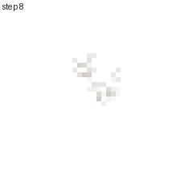
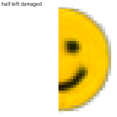
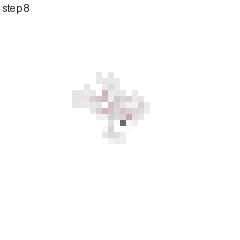
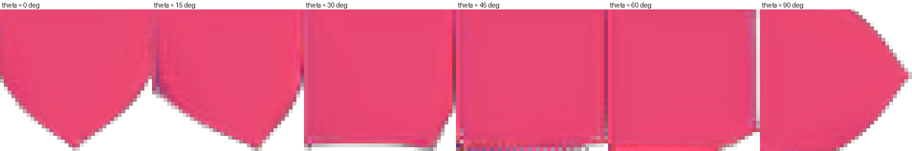
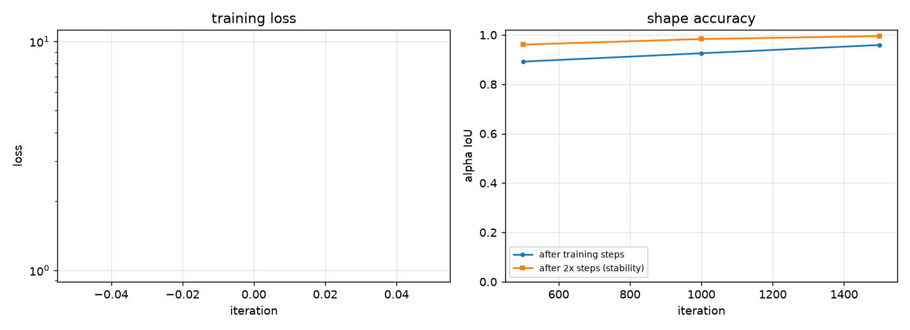
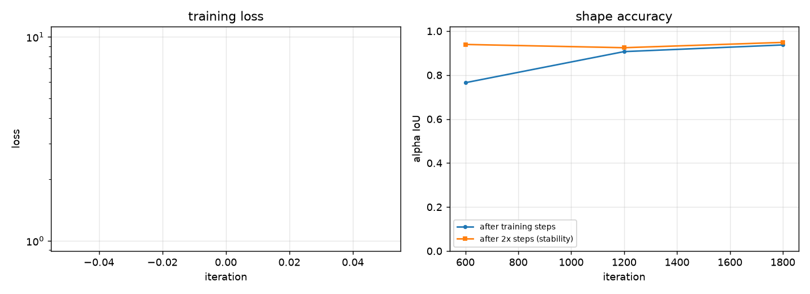

# Neural Cellular Automata

A single **8,320-parameter** convolutional network, applied repeatedly to every cell
of a 40×40 grid using only a 3×3 neighbourhood, learns to **grow a target shape from
one pixel** and to **regenerate itself when damaged**.

Trained by backpropagation through ~100 recurrent steps. No positional inputs, no
global state, no cell that knows where it is — every cell runs the same rule.

<table>
<tr>
<td align="center"><br><em>Grown from a single pixel</em></td>
<td align="center"><br><em>Half erased, then recovered</em></td>
<td align="center"><br><em>Same rule, different target</em></td>
</tr>
</table>

Implementation of *Growing Neural Cellular Automata* (Mordvintsev, Randazzo,
Niklasson & Levin — Distill, 2020), built from the paper, with its training regime
reproduced in full — and with the places where that regime does **not** generalise
measured and documented in **[docs/FINDINGS.md](docs/FINDINGS.md)**.

---

## Results

40×40 grid, batch 8. Under 5 minutes each on a laptop GPU.

| Target | Iterations | Alpha IoU | RGB MAE | Persistence IoU | Parameters |
|--------|-----------|-----------|---------|-----------------|------------|
| heart | 1,500 | **0.972** | 0.0140 | 0.998 | 8,320 |
| face | 1,800 | **0.956** | 0.1522 | 0.968 | 8,320 |

*Persistence IoU* is the shape accuracy after running **twice** as long as training
steps — a model that hits the target and then drifts or explodes scores well on
`IoU` and badly here.

### Regeneration, including damage never seen in training

Damage applied after a converged rollout. Only circular lesions are ever seen during
training.

| Damage | heart recovered IoU | face recovered IoU | Trained on this? |
|--------|--------------------|--------------------|------------------|
| Circular lesion | 0.999 | 0.953 | yes |
| Left half erased | 0.998 | 0.937 | **no** |
| Top half erased | 0.999 | 0.938 | **no** |
| Central square erased | 0.998 | 0.924 | **no** |

Recovery from the three *unseen* damage types is within 0.2 % (heart) and 3 %
(face) of the type it trained on. That is the difference between "learned to repair
circles" and "learned dynamics whose attractor is the target shape".

A short run (300 iterations) makes the mechanism legible:

| Stage | Alpha IoU | Alpha mass |
|-------|-----------|------------|
| Grown from seed | 0.911 | 1372 |
| Left half deleted | 0.479 | 681 |
| After recovery | 0.904 | **1383** |
| *Untrained model (control)* | *0.001* | — |

Mass going 681 → 1383 against an original of 1372 shows it genuinely regrew the
missing half rather than spreading what was left. The untrained control at 0.001
confirms the metric is not trivially high.

### Rotated growth without retraining

The same weights; only the axes the cells sense along are rotated.



### Training curves

<p>


</p>

---

## Findings

Three things this implementation surfaced that are not in the paper. Full
evidence and reproduction commands in **[docs/FINDINGS.md](docs/FINDINGS.md)**.

**1. The paper's gradient normalisation causes catastrophic collapse.** The paper
reports late-run instabilities and fixes them by normalising each parameter's
gradient by its L2 norm. On a target with internal structure that fix is the
*problem*: two of two `face` runs collapsed to a degenerate all-empty solution
(IoU 0.892 → **0.000** between evaluations), and none of four runs collapsed with it
disabled. It defaults to off here, at a small cost on simple targets (heart IoU
0.972 with it, 0.942 without).

**2. The collapse is invisible in the loss.** Over the window in which the model
destroyed itself, the reported training loss *improved* (0.0434 → 0.0329). Only
`persist_mass_ratio`, which fell to 0.00, revealed it. Loss alone is not a usable
progress signal for this model.

**3. Target size does not predict difficulty; internal structure does.** The heart
is strictly harder than the face on every size measure — 25 % more coverage and a
54 % larger radius from the seed — and trains more easily. Placing features at
specific locations (two eyes, a mouth) is what costs the model, not distance.

---

## Quickstart

```bash
pip install -r requirements.txt
python -m tests.run_tests                      # 41 tests, ~5s
```

Train and render:

```bash
python -m nca.train --shape heart --iterations 1500 --out-dir runs/heart

python -m nca.render grow       --checkpoint runs/heart/checkpoint.pt
python -m nca.render regenerate --checkpoint runs/heart/checkpoint.pt
python -m nca.render rotate     --checkpoint runs/heart/checkpoint.pt
python -m nca.render plot       --run-dir runs/heart
```

Targets with internal structure need a smaller lesion and the normalisation off:

```bash
python -m nca.train --shape face --iterations 1800 \
    --damage-radius 0.14 --out-dir runs/face
```

Interrupt a long run and continue with `--resume runs/heart/checkpoint.pt`. Ten
procedural targets: `circle ring square cross diamond triangle hexagon star heart
face`. Bring your own image with `--target-path assets/logo.png`.

Measured on an RTX 4050 Laptop: ~7 iterations/s at 40×40, batch 8, under 1 GB VRAM.
The cost is the 64–96 sequential steps, not the model size — batch size is nearly
free, step count is linear.

---

## How it works

Each cell holds a 16-dimensional state: RGB, alpha, and twelve hidden channels with
no assigned meaning (the paper's analogy is chemical concentrations). One shared
network is applied to every cell, every step:

**Perceive.** Fixed, never-trained 3×3 Sobel filters give each cell its own 16
channels plus the x- and y-gradient of all of them — a 48-dimensional perception
vector. Fixed sensors are the point: real cells sense *gradients*, and a gradient is
translation-invariant, which is exactly the bias needed for "grow the shape wherever
you are".

**Update.** `Linear(48→128) → ReLU → Linear(128→16)`, i.e. two 1×1 convolutions. The
final layer is **zero-initialised** so the untrained model is a no-op and training
starts as a small perturbation of a fixed point. No ReLU on the output, because
increments must be able to be negative.

**Fire.** Each cell independently applies its update with probability 0.5. No global
clock; this is per-pixel dropout on the update vector, and it stops the grid
oscillating in lockstep.

**Prune.** Any cell with no opaque cell in its 3×3 neighbourhood is zeroed across
*all* channels. This deletes debris that detaches from the body, which is what keeps
the pattern a single connected organism — and therefore what makes it heal a wound
instead of starting a second blob beside it.

### Why training is not just "seed → target"

The naive loop learns one trajectory, not an attractor, and the model drifts or
explodes when run past its training length. Three fixes, all implemented:

- **A sample pool of 1,024 states.** Sample a batch, train, then *write the outputs
  back*. The pool fills with the model's own intermediate states, so it is forced to
  recover from its own mistakes — training on the distribution of your own failures
  is what turns a trajectory into a basin of attraction.
- **Reseed the worst state each batch with the true seed**, so the rule never forgets
  how to grow from nothing.
- **Damage the *most-converged* states**, not the worst. Those are where the
  attractor boundary actually is.

---

## Project layout

```
nca/model.py     The automaton: NCA, Perception, loss
nca/targets.py   Procedural RGBA targets + seed (no downloaded assets)
nca/damage.py    Lesion operators for training and evaluation
nca/pool.py      The sample pool
nca/metrics.py   IoU, colour error, persistence
nca/train.py     Training loop, checkpoints, resume, CLI
nca/render.py    GIFs and plots, CLI
tests/           41 invariant tests
```

## Documentation

- **[docs/FINDINGS.md](docs/FINDINGS.md)** — what this implementation discovered
  that the paper does not report, with evidence and reproduction commands.
- **[docs/RESEARCH.md](docs/RESEARCH.md)** — the science. The question the paper
  asks, why each design decision exists, the four experiments, limitations and open
  problems, and the related literature.
- **[docs/ARCHITECTURE.md](docs/ARCHITECTURE.md)** — code map, tensor shapes, the
  invariant table, design decisions with reasons, and the gotchas.
- **[docs/EXPERIMENTS.md](docs/EXPERIMENTS.md)** — how to run each experiment, an
  ablation table (every claim above is a flag you can test), and open questions.

## Design notes

- **Targets are written to be honest about the loss.** RGB is premultiplied by alpha,
  so transparent regions carry no colour and the network is never asked to reproduce
  arbitrary colour in empty space.
- **Tests assert properties, not shapes.** Locality is checked to be *exactly* 3×3,
  translation equivariance is verified under circular padding, and damage is checked
  to erase every channel rather than just RGB — because clearing alpha is what marks
  a cell dead.
- **Metrics separate "grew it" from "kept it".** Finding 2 is the reason; a model
  that hits the target at step 96 and explodes at step 200 has a great loss and is
  useless.

## Limitations

- **Resolution.** Works at 40×40, degrades at 512×512. Every cell must converge on a
  global shape through a 3×3 receptive field. This is the field's main open problem.
- **Slow.** ~100 sequential steps, no parallelism across the sequence.
- **No size generalisation.** A model trained at 40×40 does not transfer to 80×80.
- **Not every configuration converges.** See `docs/FINDINGS.md`; the failure mode is
  silent and only the persistence metrics catch it.
- **Not a product.** No web UI and no pretrained weights in-repo. This is the
  research artifact.

## References

1. Mordvintsev, A., Randazzo, E., Niklasson, E., Levin, M. (2020). *Growing Neural
   Cellular Automata.* Distill. [doi:10.23915/distill.00023](https://distill.pub/2020/growing-ca/)
2. Randazzo, E., et al. (2020). *Self-classifying MNIST Digits.* Distill.
3. Chan, B. (2019). *Lenia: Biology of Artificial Life.*
4. *Neural Cellular Automata: From Cells to Pixels.* ACM, 2026.

## License

MIT
