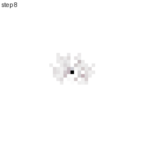
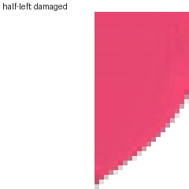
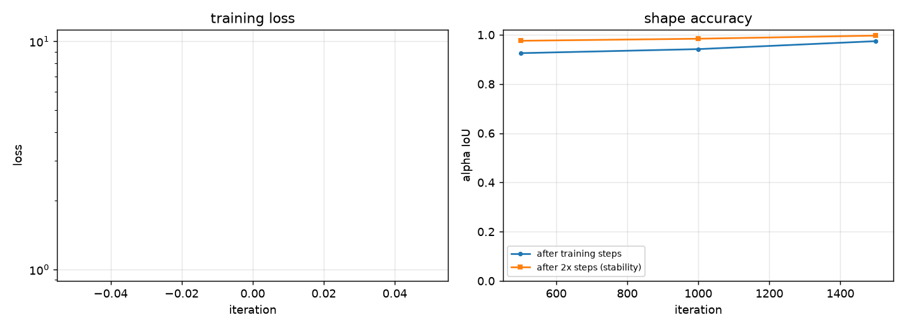

# Neural Cellular Automata

A single **8,320-parameter** convolutional network, applied repeatedly to every cell
of a 40×40 grid using only a 3×3 neighbourhood, learns to **grow a target shape from
one pixel** and to **regenerate itself when damaged**.

Trained by backpropagation through ~100 recurrent steps. No positional inputs, no
global state, no cell that knows where it is — every cell runs the same rule.

<p align="center">
  
  
</p>
<p align="center">
  <em>Left: growing from a single pixel. Right: half the pattern deleted, then recovering.</em>
</p>

Implementation of *Growing Neural Cellular Automata* (Mordvintsev, Randazzo,
Niklasson & Levin — Distill, 2020), built from the paper with its training regime
reproduced in full.

---

## Results

Trained on a heart target, 40×40 grid, 1,500 iterations (~5 minutes on a laptop GPU):

| Metric | Value |
|--------|-------|
| Alpha IoU (shape accuracy) | **0.972** |
| RGB MAE (colour accuracy) | **0.0140** |
| Persistence IoU (after 2× the training steps) | **0.998** |
| Parameters | 8,320 |

**Regeneration**, after damage the model never saw during training:

| Damage | Recovered IoU | Trained on this? |
|--------|---------------|------------------|
| Circular lesion | 0.997 | yes |
| Left half erased | 0.991 | **no** |
| Top half erased | 0.995 | **no** |
| Central square erased | 0.996 | **no** |

Recovery from the three *unseen* damage types is within 0.6 % of the one it trained
on. That is the difference between "learned to repair circles" and "learned dynamics
whose attractor is the target shape".

**Ablation on a deliberately short run** (300 iterations) shows the effect directly:

| Stage | Alpha IoU | Alpha mass |
|-------|-----------|------------|
| Grown from seed | 0.911 | 1372 |
| Left half deleted | 0.479 | 681 |
| After recovery | 0.904 | **1383** |
| *Untrained model (control)* | *0.001* | — |

Mass going 681 → 1383 against an original of 1372 shows it genuinely regrew the
missing half rather than spreading what was left. The untrained control at 0.001
confirms the metric is not trivially high.

**Rotated growth without retraining** — the same weights, only the sensing axes
rotated:


**Training curves:**



---

## Quickstart

```bash
pip install -r requirements.txt
python -m tests.run_tests                      # 41 tests, ~5s
```

Train and render:

```bash
python -m nca.train --shape heart --iterations 1500 --out-dir runs/heart

python -m nca.render grow       --checkpoint runs/heart/checkpoint.pt
python -m nca.render regenerate --checkpoint runs/heart/checkpoint.pt
python -m nca.render rotate     --checkpoint runs/heart/checkpoint.pt
python -m nca.render plot       --run-dir runs/heart
```

Interrupt a long run and continue it with `--resume runs/heart/checkpoint.pt`.
Ten procedural targets are available: `circle ring square cross diamond triangle
hexagon star heart face`. Bring your own image with
`--target-path assets/logo.png`.

Measured on an RTX 4050 Laptop: ~4.7 iterations/s at 40×40, batch 8. Under 1 GB VRAM.
The cost is the 64–96 sequential steps, not the model size — so batch size is nearly
free and step count is linear.

---

## How it works

Each cell holds a 16-dimensional state: RGB, alpha, and twelve hidden channels with
no assigned meaning (the paper's analogy is chemical concentrations). One shared
network is applied to every cell, every step:

**Perceive.** Fixed, never-trained 3×3 Sobel filters give each cell its own 16
channels plus the x- and y-gradient of all of them — a 48-dimensional perception
vector. Fixed sensors are the point: real cells sense *gradients*, and a gradient is
translation-invariant, which is exactly the bias needed for "grow the shape wherever
you are".

**Update.** `Linear(48→128) → ReLU → Linear(128→16)`, i.e. two 1×1 convolutions. The
final layer is **zero-initialised** so the untrained model is a no-op and training
starts as a small perturbation of a fixed point. No ReLU on the output, because
increments must be able to be negative.

**Fire.** Each cell independently applies its update with probability 0.5. No global
clock; this is per-pixel dropout on the update vector, and it stops the grid
oscillating in lockstep.

**Prune.** Any cell with no opaque cell in its 3×3 neighbourhood is zeroed across
*all* channels. This deletes debris that detaches from the body, which is what keeps
the pattern a single connected organism — and therefore what makes it heal a wound
instead of starting a second blob beside it.

### Why training is not just "seed → target"

The naive loop learns one trajectory, not an attractor, and the model drifts or
explodes when run past its training length. Three fixes, all implemented:

- **A sample pool of 1,024 states.** Sample a batch, train, then *write the outputs
  back*. The pool fills with the model's own intermediate states, so it is forced to
  recover from its own mistakes — training on the distribution of your own failures
  is what turns a trajectory into a basin of attraction.
- **Reseed the worst state each batch with the true seed**, so the rule never forgets
  how to grow from nothing.
- **Damage the *most-converged* states**, not the worst. Those are where the
  attractor boundary actually is.

Plus the paper's stability fix: **per-variable gradient L2 normalisation**, which
prevents the late-run loss jumps that backprop through ~100 recurrent steps
otherwise produces.

---

## Project layout

```
nca/model.py     The automaton: NCA, Perception, loss
nca/targets.py   Procedural RGBA targets + seed (no downloaded assets)
nca/damage.py    Lesion operators for training and evaluation
nca/pool.py      The sample pool
nca/metrics.py   IoU, colour error, persistence
nca/train.py     Training loop, checkpoints, resume, CLI
nca/render.py    GIFs and plots, CLI
tests/           41 invariant tests
```

## Documentation

- **[docs/RESEARCH.md](docs/RESEARCH.md)** — the science. The question the paper
  asks, why each design decision exists, the four experiments, limitations and open
  problems, and the related literature.
- **[docs/ARCHITECTURE.md](docs/ARCHITECTURE.md)** — code map, tensor shapes, the
  invariant table, design decisions with reasons, and the gotchas.
- **[docs/EXPERIMENTS.md](docs/EXPERIMENTS.md)** — how to run each experiment, an
  ablation table (every claim above is a flag you can test), and open questions this
  repo makes cheap to answer.
- **[handoff.md](handoff.md)** — state of the project, what's verified, what's
  unresolved.

## Design notes

- **Targets are written to be honest about the loss.** RGB is premultiplied by alpha,
  so transparent regions carry no colour and the network is never asked to reproduce
  arbitrary colour in empty space.
- **Tests assert the properties that matter, not the shapes.** Locality is checked to
  be *exactly* 3×3, translation equivariance is verified under circular padding, and
  damage is checked to erase every channel rather than just RGB — because clearing
  alpha is what marks a cell dead.
- **Metrics separate "grew it" from "kept it".** A model that hits the target at step
  96 and explodes at step 200 has a great loss and is useless, so evaluation reports
  persistence over a second rollout and a mass ratio.

## Limitations

- **Resolution.** Works at 40×40, degrades at 512×512. Every cell must converge on a
  global shape through a 3×3 receptive field. This is the field's main open problem.
- **Slow.** ~100 sequential steps, no parallelism across the sequence.
- **No size generalisation.** A model trained at 40×40 does not transfer to 80×80.
- **Not every run converges.** The `face` target currently collapses to a degenerate
  "output nothing" solution — documented in `handoff.md` rather than hidden.
- **Not a product.** No web UI, no pretrained weights in-repo. This is the research
  artifact.

## References

1. Mordvintsev, A., Randazzo, E., Niklasson, E., Levin, M. (2020). *Growing Neural
   Cellular Automata.* Distill. [doi:10.23915/distill.00023](https://distill.pub/2020/growing-ca/)
2. Randazzo, E., et al. (2020). *Self-classifying MNIST Digits.* Distill.
3. Chan, B. (2019). *Lenia: Biology of Artificial Life.*
4. *Neural Cellular Automata: From Cells to Pixels.* ACM, 2026.

## License

MIT
